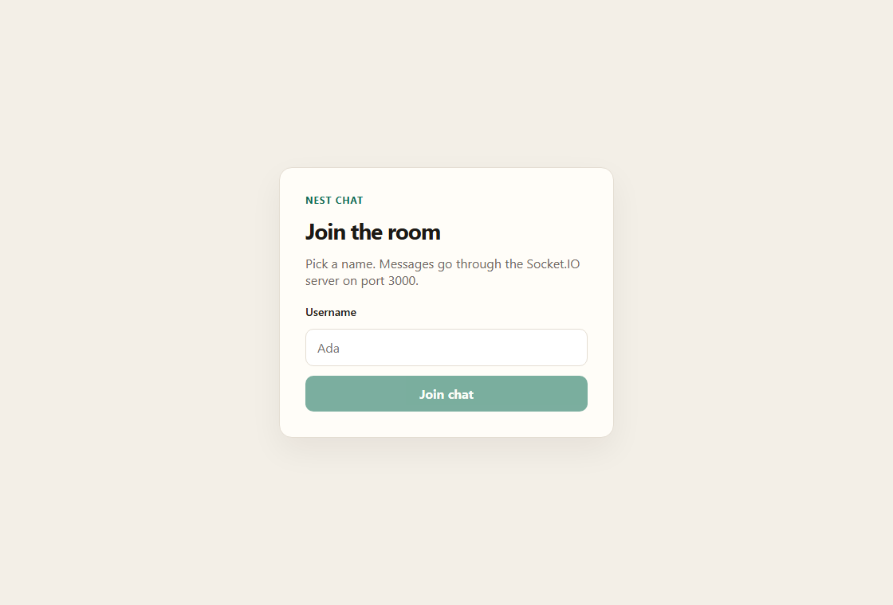
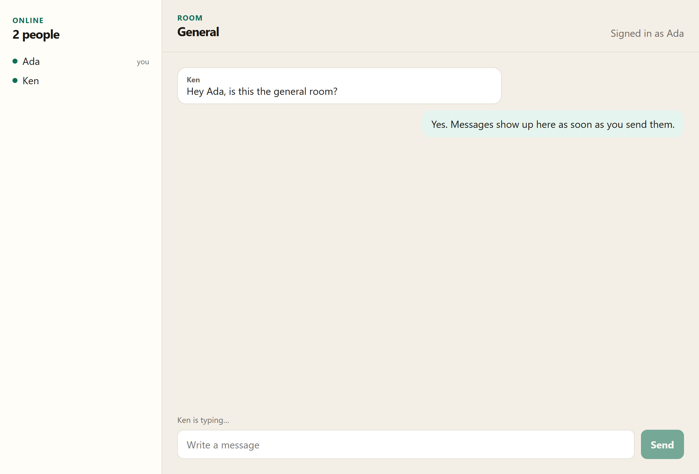

# Nest Chat

A real-time video and text room. The React client joins a shared room through a NestJS Socket.IO server. Camera and microphone streams go directly between browsers with WebRTC. The server only forwards the connection handshake.

## Screenshots

### Join the room

Pick a display name before entering the room. The browser then asks for the camera and microphone.



### General room

The room lists who is online, shows the conversation, and shows when someone is typing. After you allow the camera, your video and other people's video sit above the messages.



## Project layout

| Folder | What it is |
| --- | --- |
| `client` | React + TypeScript app, served by Vite on port 5173 |
| `chat-app` | NestJS API and Socket.IO gateway on port 3000 |

## Run it locally

Use two terminals.

**Server**

```bash
cd chat-app
npm install
npm run start:dev
```

**Client**

```bash
cd client
npm install
npm run dev
```

Open [http://localhost:5173](http://localhost:5173). The client talks to `http://localhost:3000` while you are on localhost. On any other host it uses the page’s own origin, and Vite proxies `/socket.io` to the Nest server.

To see video both ways, open the app in two browsers, join with two different names, and allow the camera in each one.

## What the room does

- Join the **General** room with a username.
- Show your camera, and the camera of each other person in the room.
- Mute your microphone or stop your camera without leaving the room.
- Stay in the room for text chat if the camera or microphone is blocked.
- See who is online, including a “you” marker for the signed-in user.
- Send messages. Yours appear on the right; everyone else’s appear on the left with their name.
- Show “is typing…” while someone else is writing.

The person who just joined offers a video connection to everyone already in the room. Media then flows peer to peer. A public STUN server (`stun:stun.l.google.com:19302`) helps the browsers find each other. This fits a small room, because every person connects directly to every other person.

Names, presence, and messages are kept in memory, so they clear when the server restarts.

## Socket events

| Event | Direction | Purpose |
| --- | --- | --- |
| `join` | client → server | Enter the room. The acknowledgement is `{ user, peers }`, where `peers` are the people already there |
| `users` | server → client | Replace the online list |
| `message` | both | Broadcast a chat message |
| `typing` | both | Broadcast whether a user is typing |
| `signal` | client → one peer | Forward a WebRTC offer, answer, or ICE candidate. The sender addresses it with `to`; the receiver gets `from` |
| `user-left` | server → client | Someone disconnected. Clients close that person's video connection |
